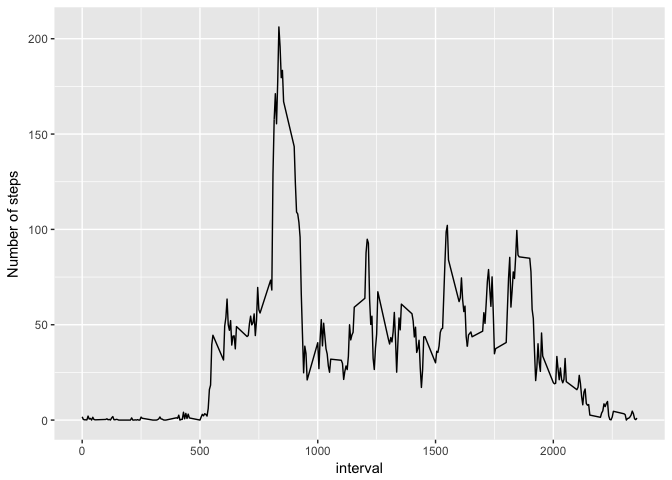

# Reproducible Research: Peer Assessment 1


### Loading and preprocessing the data

Load necessary libraries first:

```r
library(ggplot2)
library(dplyr)
library(tidyr)
```

Load the activity.csv file and process the date field (if necessary)


```r
activity <- read.csv("activity.csv")
```


### What is mean total number of steps taken per day?

Create a histogram counting the number of days per total amount of steps taken.


```r
sums <- summarise(group_by(activity, date), sumsteps=sum(steps))

sm <- filter(sums, !is.na(sumsteps))
ggplot(data=sm, aes(sumsteps)) + geom_histogram(binwidth=1000) + 
    scale_y_continuous(breaks=seq(0,10,1)) + scale_x_continuous(breaks=seq(0,30000,2000)) +
    xlab("Steps per day")
```

<!-- -->

Get the mean and median of the total number of steps taken per day

```r
actmean <- mean(sums$sumsteps, na.rm=T)
actmedian <- median(sums$sumsteps, na.rm=T)
```

The mean number of steps per day is 10766.19 and the median is 10765


### What is the average daily activity pattern?

Plot the number of steps for each 5 minute interval averaged across all days 
  and determine at which interval on average has the most number of steps.


```r
means <- summarise(group_by(activity, interval), meansteps=mean(steps, na.rm=T))

ggplot(data=means, aes(interval, meansteps)) + geom_line() +
    ylab("Number of steps")
```

<!-- -->

```r
intervalmax <- means[order(means$meansteps, decreasing =T)[1],1]
```

5-minute interval 835 has the most number of steps across all days


### Imputing missing values

Report total number of missing values in the dataset

```r
numberNA <- sum(is.na(activity))
```
Total number of NA values is 2304.
This turns out to be exactly 8 days with no steps info for any 5-min interval

My strategy to impute missing values is to add the mean for each 5-minute interval of the experiment to the corresponding 5-min interval with NA


```r
activitynew <- left_join(activity, means, by = "interval")
my.na <- is.na(activitynew$steps)
activitynew$steps[my.na] <- activitynew$meansteps[my.na]

sumsnew <- summarise(group_by(activitynew, date), sumsteps=sum(steps))

ggplot(data=sumsnew, aes(sumsteps)) + geom_histogram(binwidth=1000) + 
    scale_y_continuous(breaks=seq(0,20,1)) + scale_x_continuous(breaks=seq(0,30000,2000)) +
    xlab("Steps per day")
```

<!-- -->

After imputing new values, get the mean and median of the total number of steps taken per day:

```r
actnewmean <- mean(sumsnew$sumsteps, na.rm=T)
actnewmedian <- median(sumsnew$sumsteps, na.rm=T)
```

The mean number of steps per day is 10766.19 and the median is 10766.19

The mean has not changed, obviously, as the imputing strategy was to add the mean number of steps per 5min interval to the days with missing values. The median has changed.

### Are there differences in activity patterns between weekdays and weekends?


```r
activitynew$day <- weekdays(as.Date(activitynew$date))

weekend <- activitynew$day == "Saturday" | activitynew$day == "Sunday"
activitynew$day[weekend] <- "weekend"
activitynew$day[!weekend] <- "weekday"
activitynew$day <- as.factor(activitynew$day)

means <- summarise(group_by(activitynew, interval, day), meansteps=mean(steps, na.rm=T))

ggplot(data=means, aes(interval, meansteps)) + geom_line() + facet_grid(day~.) +
    ylab("Number of steps")
```

<!-- -->

Activity patterns are different between weekdays and weekends. 

It appears that weekend activity starts later and activity remains present during the day. During weekdays the initial morning activity spike is folowed by relative inactivity.


